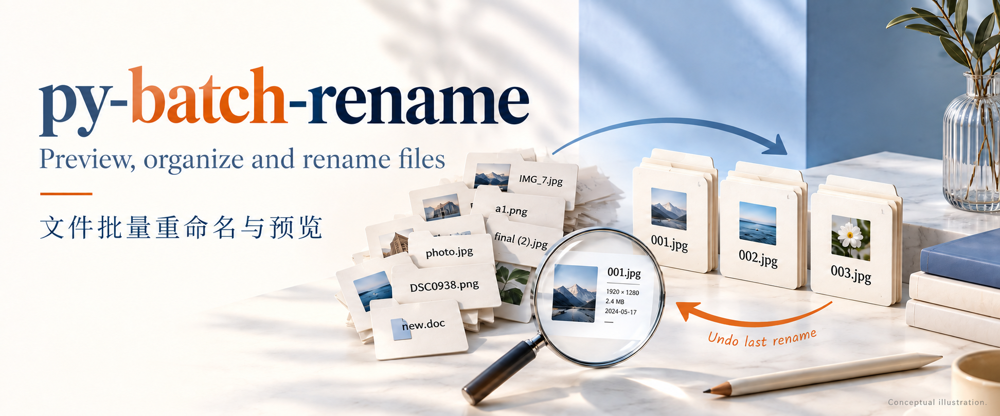

<p align="center">
  
</p>

# py-batch-rename

**添加文件、选择命名规则、检查预览，再一次应用到整个批次。**

A local Python / PySide6 batch renamer with live filename previews, duplicate-target checks, and undo for the last successful rename. Useful for organizing measurement files, images, and document collections.

[安装与启动](#安装--快速开始) · [命名规则](#功能) · [使用说明](#使用说明) · [许可说明](#说明与许可)

<picture>
  <source media="(max-width: 600px)" srcset="assets/readme/diagrams/workflow-readme-md-1-mobile.svg">
  
</picture>

<sub>[Editable diagram source / 可编辑图源](assets/readme/diagrams/workflow-readme-md-1.mmd)</sub>

| 处理任务 | 对应规则 |
| --- | --- |
| 按样品或序号统一命名 | 自定义名称与编号 |
| 替换文件名中的旧标识 | 查找替换、插入或删除 |
| 使用已有命名清单 | Excel / CSV 第一列，按文件列表顺序匹配 |

这是独立实现的批量改名工具。撤回适用于上一次成功的重命名；Windows 时间属性修改单独处理，不属于命名撤回范围。

## 原理示意 / Principle schematic

<p align="center">
  
</p>

*文件名一一映射与扩展名保留；重复目标需检查，可撤回上一次成功改名。概念示意，非实际界面。*

*One-to-one filename mapping with extensions retained, duplicate-target checks and last-rename undo. Conceptual schematic, not an actual interface.*

[查看完整示意图 / View full-size schematic](assets/readme/principle.png)

## 功能

| 命名方式 | 做什么 |
| --- | --- |
| 自定义 | 新文件名 + 编号（起始 / 增量 / 位数） |
| 替换 | 查找并替换文件名中的文字 |
| 插入 | 在文件名头、文件名尾或指定位置插入文字或编号 |
| 删除 | 删除指定内容，或按开始位置 + 长度删除 |
| 时间属性 | 修改创建时间和/或修改时间（Windows） |
| 导入表格 | Excel / CSV 第一列按列表顺序作为新文件名；保留原来的拓展名 |
| 一键删除 | 去掉括号、空格、字母、数字或引号 |
| 时间命名 | 用创建时间或修改时间生成文件名（四种时间样式） |

另支持大小写转换、拓展名修改，以及：

- 规则一变，表格「新文件名」列立刻预览（不会先改磁盘）
- 批次内目标重名拦截
- 自然排序（`2` 在 `10` 前）
- 「命名撤回」把上一次成功的重命名改回去（改时间属性除外）

## 安装 / 快速开始

需要 Python **3.10+**。

```text
pip install -r requirements.txt
python run.py
```

也可以：

```text
python -m py_batch_rename
```

依赖：`PySide6`、`openpyxl`。Windows 上可以改文件的创建时间和修改时间。

## 使用说明

1. 添加文件或文件夹到列表  
2. 选择命名方式并调参数，看右侧「新文件名」预览  
3. 确认无重名警告后写盘  
4. 需要时用「命名撤回」恢复上一次成功操作  

把鼠标放在工具栏按钮、命名方式、编号和拓展名变更上，会显示中文说明。

## 边界 — 它不是什么

- **不是** 优速（yoso-rename）的破解、镜像或源码移植
- **不是** 云端改名服务；全部在本地运行
- 时间属性修改目前面向 **Windows**；其他平台能力可能受限
- 写盘前请自行确认预览；工具会拦批次内重名，但不会替你做版本备份

## 测试

```text
python -m pytest tests -q
python run.py --smoke
```

## 说明与许可

优速文件批量重命名是苏州跳跳鱼智能科技有限公司的闭源商业软件。本仓库按公开功能重写，代码与界面均为独立作品，请勿将其当作原软件源码。

本仓库当前未附独立 LICENSE 文件。
